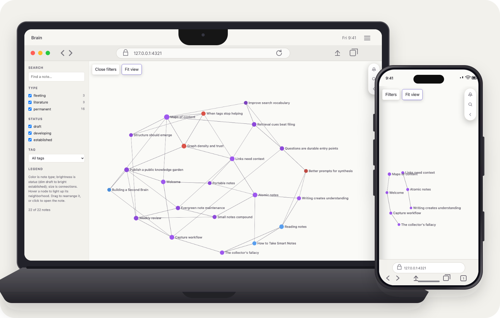

# Brain

Brain turns a plain Markdown Obsidian vault into a static, searchable second-brain site. The same generator runs from source, as a non-root OCI image, or through a composite GitHub Action that can feed a GitHub Pages workflow.



## Get started

- [Run your vault locally with Docker](#start-with-docker)
- [Publish your vault with GitHub Pages](#publish-with-github-pages)
- [Prepare your vault](#vault-format)
- [Build Brain from source](#source-build)

## Start with Docker

You only need [Docker Desktop](https://www.docker.com/products/docker-desktop/), or Docker Engine on Linux, and an Obsidian vault. You do not need Node.js or a copy of this repository. Brain mounts the vault read-only, so it does not change your notes.

1. Install and start Docker.
2. Open a terminal in your Obsidian vault folder.
3. Run this command:

   ```sh
   docker run --rm --init --read-only --publish 127.0.0.1:4321:4321 --mount "type=bind,src=$PWD,dst=/vault,readonly" --tmpfs /work:rw,mode=1777 --tmpfs /tmp:rw,mode=1777 ghcr.io/tjakobsson/brain:v1 serve --vault /vault --output /work/site --host 0.0.0.0 --port 4321
   ```

4. Open [http://127.0.0.1:4321/](http://127.0.0.1:4321/) in a browser.

Keep the terminal open while using Brain. Changes to the vault rebuild the site and reload the browser after a successful build. Press `Ctrl+C` to stop it.

The `v1` image tracks backward-compatible v1 releases. Pin an exact version or digest when the deployment must not move.

## Publish with GitHub Pages

GitHub Actions can rebuild and publish the site whenever you push changes to your vault. Only use this with a vault intended for public reading: Brain publishes every included note and referenced attachment.

1. Create a GitHub repository for your vault and push the vault files to its `main` branch.
2. Open the repository's **Settings > Pages** and set **Source** to **GitHub Actions**.
3. Add [`pages-major.yml`](docs/examples/pages-major.yml) to the vault repository as `.github/workflows/pages.yml`.
4. Commit and push the workflow. Follow the **Publish second brain** run in the repository's **Actions** tab; its deploy job links to the published site.

The workflow grants only the permissions needed to read the vault and publish GitHub Pages. For an immutable deployment, replace `tjakobsson/brain@v1` with a full Brain commit SHA.

## Vault Format

Note filenames are titles and must be unique across the vault. Do not repeat the title as an H1. Optional frontmatter controls note type, maturity, tags, and dates:

```yaml
---
type: permanent
status: established
tags: [pkm, web]
created: 2026-08-26
updated: 2026-08-27
---
```

Wiki-links use titles, not paths: `[[Portable notes]]`, `[[Portable notes|an alias]]`, or `[[Portable notes#Heading]]`. Unresolved note links produce warnings unless strict validation is enabled.

## Source Build

Node.js 22.12 or newer is required:

```sh
npm ci
node scripts/generator.mjs build \
  --vault examples/demo-vault \
  --output .generated/source-site \
  --site https://example.com \
  --base /notes \
  --strict-links
```

Preview performs a fresh production build, then serves it without live reload or browser editing:

```sh
node scripts/generator.mjs preview \
  --vault examples/demo-vault \
  --output .generated/source-preview \
  --base /notes \
  --port 4322
```

Open `http://localhost:4322/notes/`.

For live authoring, `serve` watches the vault and runs the same complete production build and Pagefind indexing after changes. It keeps the last successful site available if a note is temporarily invalid and reloads the browser only after a successful replacement:

```sh
node scripts/generator.mjs serve \
  --vault examples/demo-vault \
  --output .generated/source-live \
  --port 4321
```

## Build the Docker image locally

To run the exact code in this checkout instead of the published `v1` image, build the multi-stage image:

```sh
docker build --tag brain:source .
```

Use `brain:source` in place of `ghcr.io/tjakobsson/brain:v1` in the quick-start command above.

For a one-shot static build, prepare caller-owned output directories:

```sh
mkdir -p .generated/docker-output .generated/docker-work
```

Generate the demo site without runtime network access:

```sh
docker run --rm \
  --read-only \
  --network none \
  --user "$(id -u):$(id -g)" \
  --mount "type=bind,src=$PWD/examples/demo-vault,dst=/vault,readonly" \
  --mount "type=bind,src=$PWD/.generated/docker-output,dst=/output" \
  --mount "type=bind,src=$PWD/.generated/docker-work,dst=/work" \
  --tmpfs /tmp:rw,mode=1777 \
  brain:source build \
  --vault /vault \
  --output /output/site \
  --site https://example.com \
  --base /notes \
  --strict-links
```

The output is `.generated/docker-output/site`. Mount a writable output parent and select a child such as `/output/site`; atomic replacement needs permission to rename within the parent.

Container preview uses the same inputs and validation:

```sh
docker run --rm \
  --read-only \
  --user "$(id -u):$(id -g)" \
  --publish 127.0.0.1:4322:4322 \
  --mount "type=bind,src=$PWD/examples/demo-vault,dst=/vault,readonly" \
  --mount "type=bind,src=$PWD/.generated/docker-output,dst=/output" \
  --mount "type=bind,src=$PWD/.generated/docker-work,dst=/work" \
  --tmpfs /tmp:rw,mode=1777 \
  brain:source preview \
  --vault /vault \
  --output /output/preview \
  --base /notes \
  --host 0.0.0.0 \
  --port 4322
```

Open `http://127.0.0.1:4322/notes/`.

## Podman

Build and run the same Dockerfile. On Linux, `--userns=keep-id` maps generated files to the caller:

```sh
podman build --tag brain:source .
mkdir -p .generated/podman-output .generated/podman-work
podman run --rm \
  --read-only \
  --network none \
  --userns=keep-id \
  --user "$(id -u):$(id -g)" \
  --mount "type=bind,src=$PWD/examples/demo-vault,dst=/vault,readonly" \
  --mount "type=bind,src=$PWD/.generated/podman-output,dst=/output" \
  --mount "type=bind,src=$PWD/.generated/podman-work,dst=/work" \
  --tmpfs /tmp:rw,mode=1777 \
  brain:source build \
  --vault /vault \
  --output /output/site \
  --site https://example.com \
  --base /notes \
  --strict-links
```

Podman on macOS or Windows first requires a running Podman machine and shared access to the checkout directory.

## Generator Inputs

| Option | Default | Meaning |
| --- | --- | --- |
| `--vault <path>` | `./examples/demo-vault` | Readable Obsidian vault |
| `--output <path>` | `./dist` | Static output directory |
| `--site <origin>` | unset | Canonical HTTP(S) origin without a path |
| `--base <path>` | `/` | Root or project deployment path |
| `--exclude <glob>` | none | Additional vault exclusion; repeatable |
| `--strict-links` | off | Fail on unresolved wiki-links |
| `--host <host>` | `localhost` | Preview or live-server bind host |
| `--port <port>` | `4321` | Preview or live-server port |

Hidden path segments, `.obsidian`, `.github`, and `Templates` are excluded by default. An excluded referenced attachment is an error. An excluded linked note becomes an unresolved-link warning or, with `--strict-links`, an error.

The generator rejects invalid URLs, unsafe output locations, unreadable or empty vaults, duplicate titles, invalid frontmatter, missing or ambiguous attachments, and unwritable output parents. Output promotion is atomic, so a failed build preserves the previous site.

## Attachments

The generator publishes only referenced files while preserving their vault-relative paths. Supported references are:

```md

[Download](media/reference.txt)
![[media/diagram.svg|Obsidian image alias]]
```

Paths may be relative to the note or vault root. A unique filename can resolve without a directory; ambiguous filenames fail. Missing, excluded, escaping-symlink, and outside-vault targets fail the build. Raw HTML references, plugin-specific embeds, and Markdown transclusion are not attachment inputs.

## Deployment Addressing

For project Pages, pass the origin separately from the repository base:

```sh
node scripts/generator.mjs build \
  --vault examples/demo-vault \
  --output .generated/project-pages \
  --site https://user.github.io \
  --base /vault-repo
```

For root Pages or a custom domain, use `/`:

```sh
node scripts/generator.mjs build \
  --vault examples/demo-vault \
  --output .generated/custom-domain \
  --site https://notes.example.com \
  --base /
```

The Pages examples derive both values from GitHub Pages configuration, including custom domains.

## GitHub Action

The Linux composite Action creates caller-owned directories, runs the immutable release image as the runner UID/GID, and returns `output-path`. `exclusions` is newline-delimited.

Use `tjakobsson/brain@v1` for compatible v1 updates or replace `v1` with a reviewed full commit SHA for an immutable toolchain. See [`docs/examples/build-action-major.yml`](docs/examples/build-action-major.yml) for a complete example.

## GitHub Pages

In the vault repository, select **Settings > Pages > Build and deployment > Source > GitHub Actions**. The workflow grants only `contents: read`, `pages: write`, and `id-token: write`. It checks out the vault, builds with `tjakobsson/brain`, uploads one official Pages artifact, and deploys through the `github-pages` environment.

Use `tjakobsson/brain@v1` in the build step for compatible v1 updates or replace `v1` with a reviewed full commit SHA for immutable deployment. See [`docs/examples/pages-major.yml`](docs/examples/pages-major.yml).

Removing or renaming an input, changing a default or output, or changing supported behavior requires a new major release. Backward-compatible fixes update the maintained major reference. A full SHA never moves.

## Rollback

For a failed local generation, fix the input and rerun; atomic promotion leaves the prior output untouched. For automation regressions, pin the prior Action commit SHA and its associated image digest. Release notes identify the source commit, OCI digest, SBOM, provenance, and compatibility level. Repository migration rollback restores the vault from its verified consumer repository before changing publication workflows.

## Verification

```sh
npm test
npm run test:browser
npx astro build
actionlint .github/workflows/*.yml
```

Generate the deterministic 2,000-note stress vault with `npm run vault:generate`.

## License

Brain is available under the [MIT License](LICENSE). Third-party notices are listed in [`THIRD_PARTY_NOTICES.md`](THIRD_PARTY_NOTICES.md).
