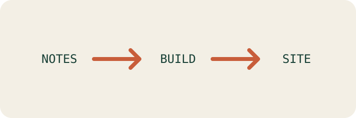

Portable notes keep their meaning in plain Markdown while linking back to
[[Welcome|the demo entry point]].

The format works best when [[Atomic notes]] have descriptive titles and
[[Links need context|links explain why two ideas belong together]].

Standard Markdown images work too:

## Portable building blocks

| Building block | Plain Markdown source | Published purpose | Portability check |
| --- | --- | --- | --- |
| Note | A uniquely named `.md` file | Presents one focused idea | Opens in any text editor |
| Link | `[[Atomic notes]]` | Connects related ideas | Remains readable as plain text |
| Attachment | A relative file reference | Adds supporting context | Travels with the vault |
| Metadata | Optional YAML frontmatter | Supports filtering and status | Does not replace the note body |

> [!note] Plain text remains primary
> Tables and callouts add structure without replacing the Markdown source.

> [!warning] Keep links title-based
> Brain wiki-links target note titles rather than folder paths, so moving a note does not break its connections.
