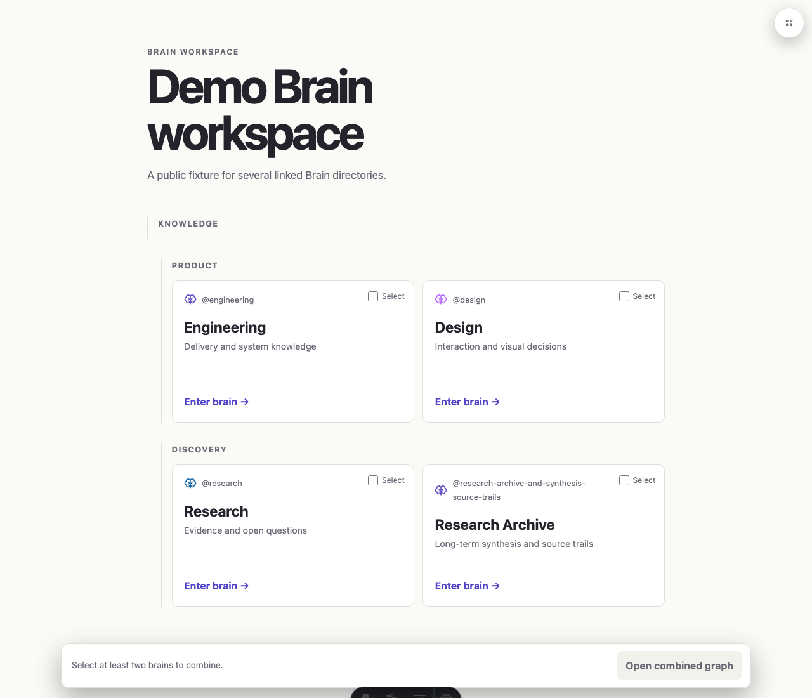
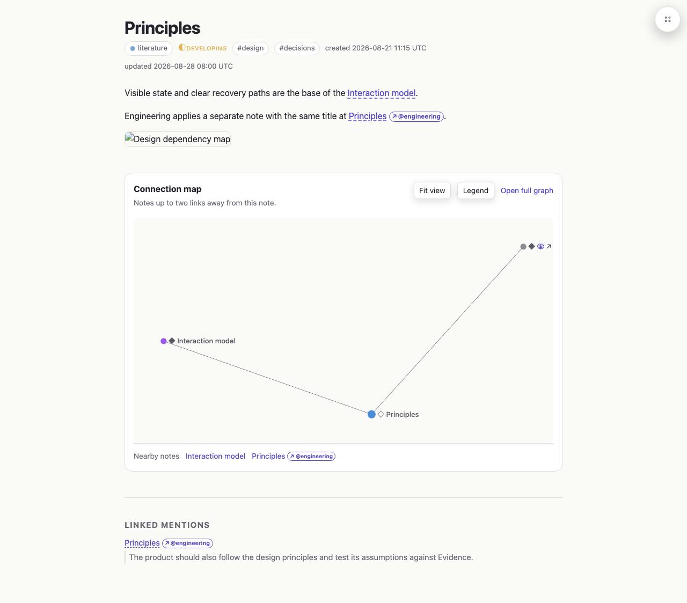
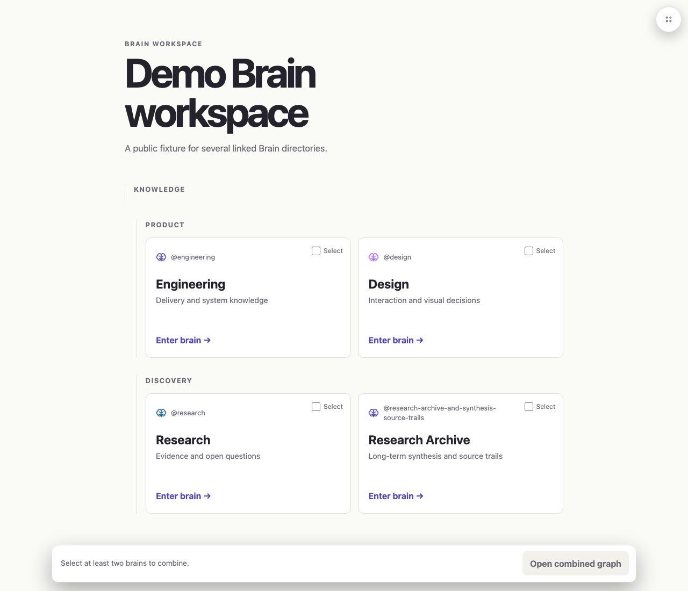
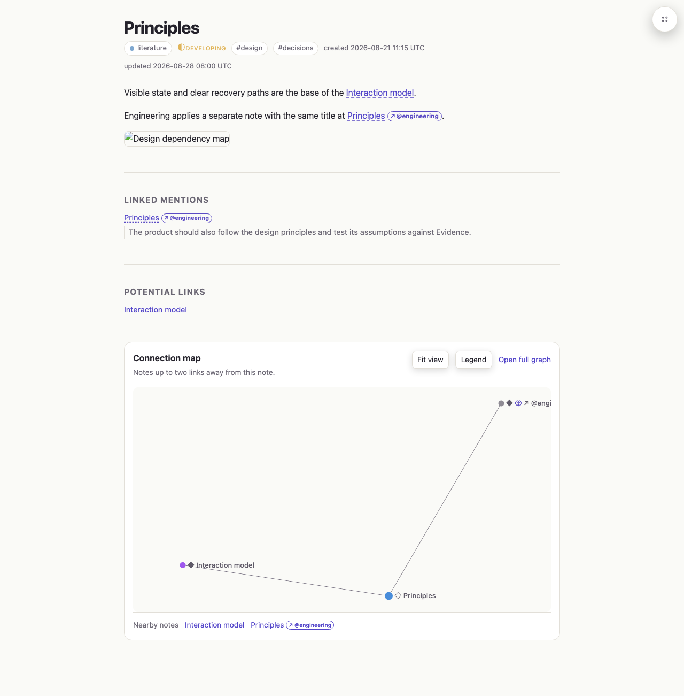
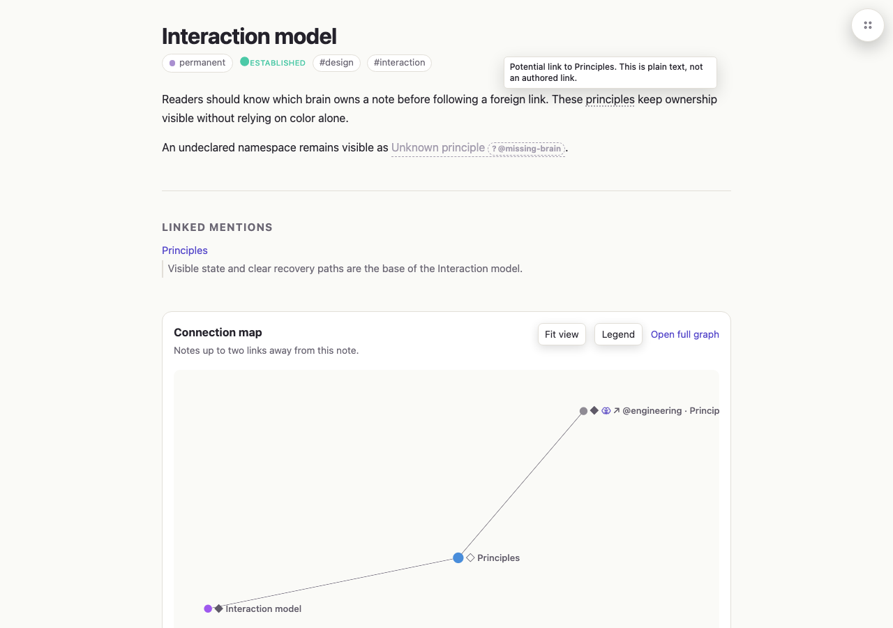

# Screenshot catalog

## Baseline

### Brain cards

Desktop, 1280 x 1100. The wrapped Brain ID pushes the card title below the title in the adjacent card.

### Mention and map order

Desktop, 1280 pixels wide. The Connection map appears before Linked mentions.

## Corrected

### Brain cards

Desktop, 1280 x 1100. The complete wrapped Brain ID remains visible while card content and actions align.

### Mention and map order

Desktop, 1280 pixels wide. Linked mentions and Potential links appear before the Connection map.

### Inline potential link

Desktop, 1280 x 900, hovered state. The plain-text `principles` title match retains the prose color, uses a subtle dotted underline, and explains its non-authored Potential-link status in a neutral badge.

