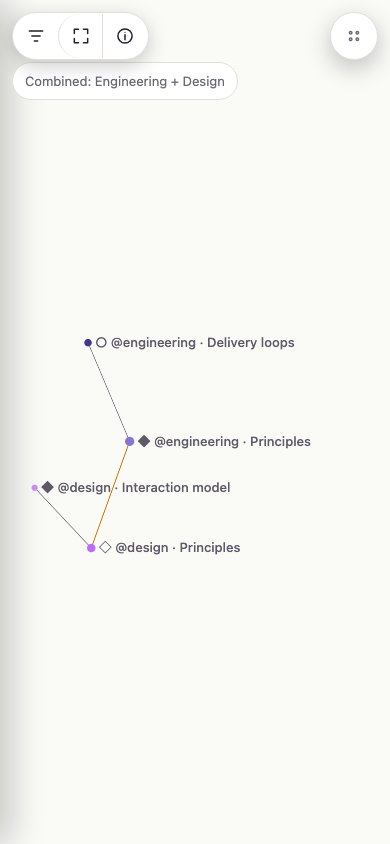
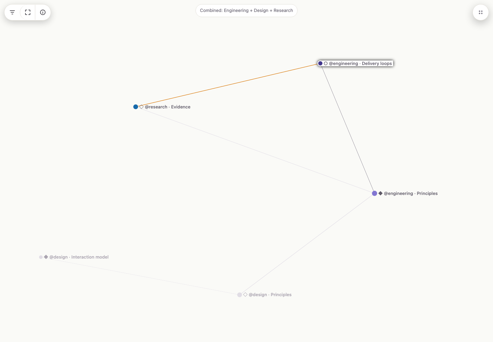
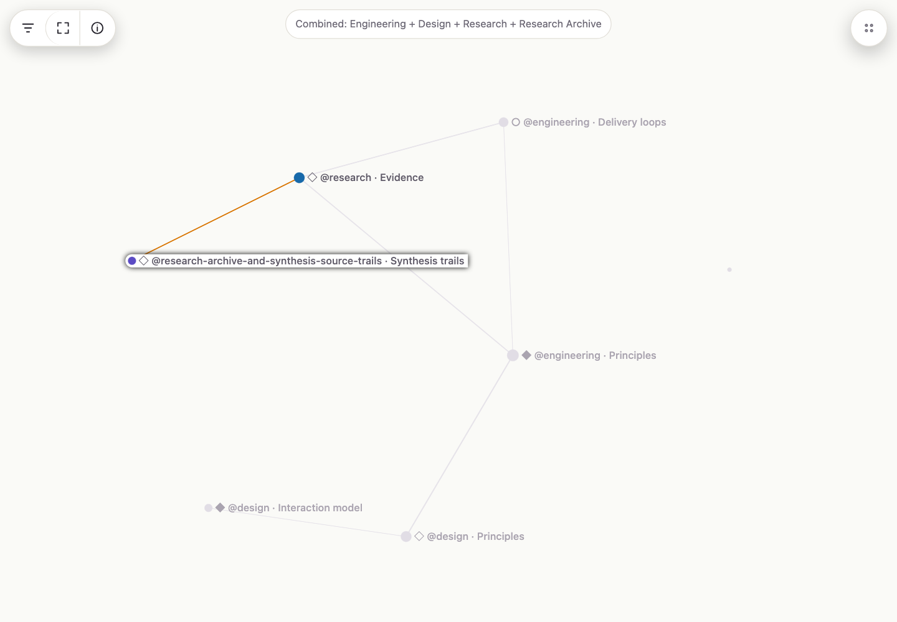
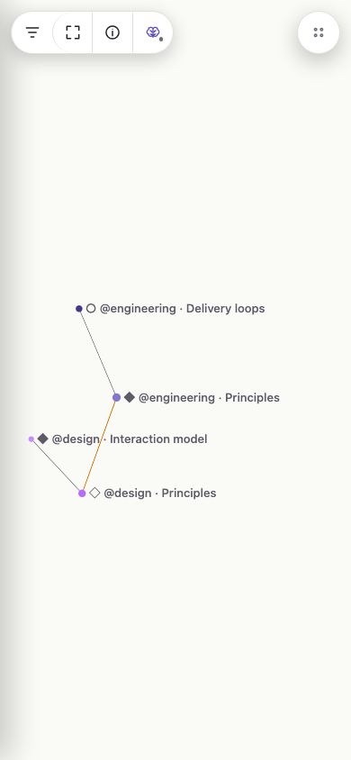
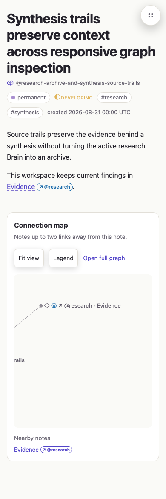
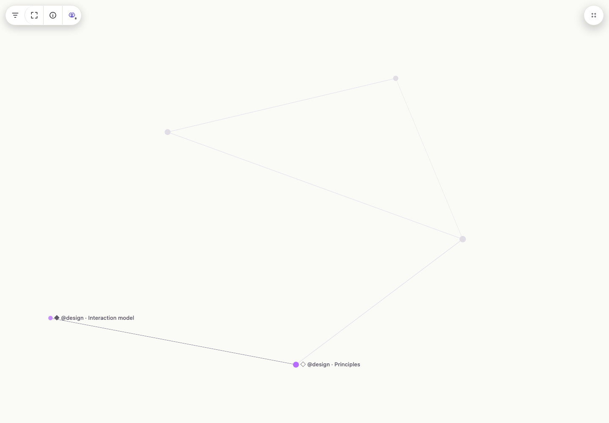
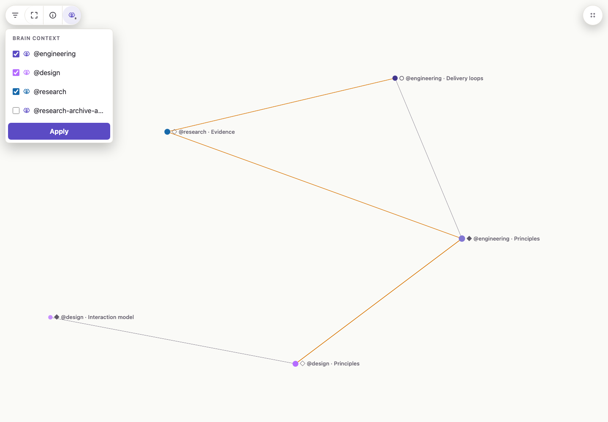
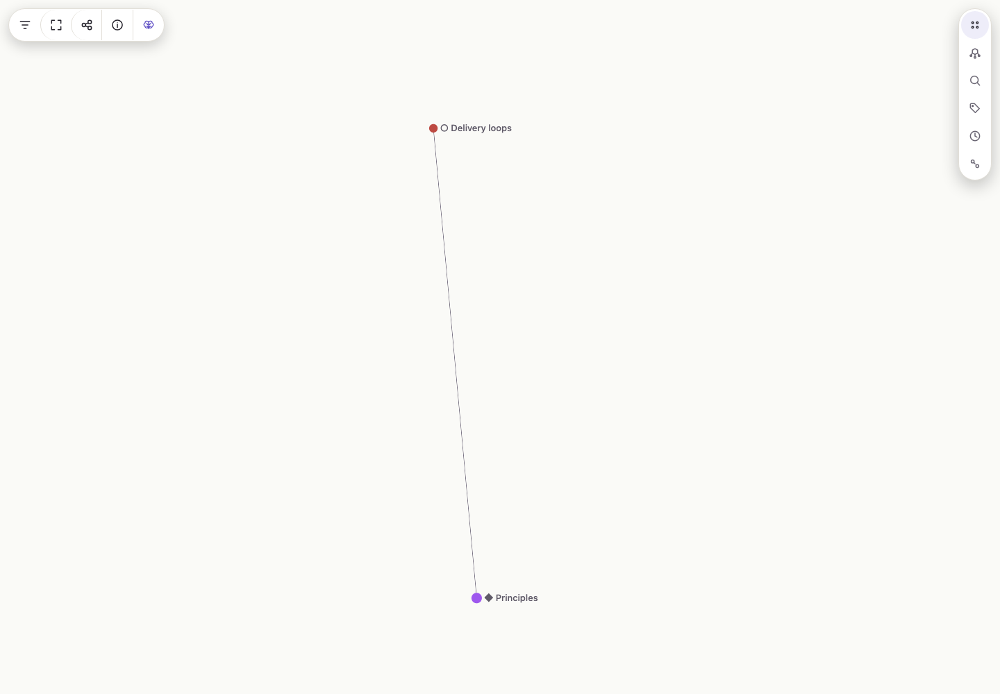
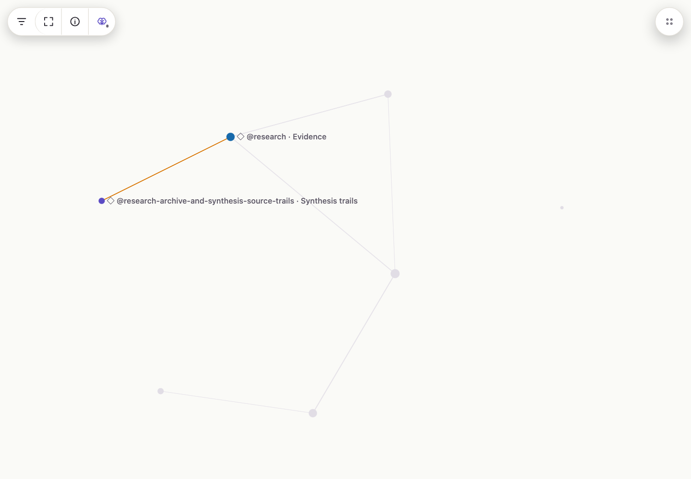

# Screenshot catalog

The Microsoft Edge captures requested by the change use Playwright Chromium because Edge was not installed on the capture machine and its installer required interactive administrator access. Chromium is recorded explicitly rather than presented as Edge.

## Baseline

### Phone combined graph

- Route: `/workspace-demo/graph?brains=engineering,design`
- Browser: Playwright Chromium 151.0.7922.34
- Viewport: 390 x 844 CSS pixels, iPhone standalone-style viewport
- Zoom: 100%
- Color scheme: light
- Interaction: settled combined graph, no inspection

### Desktop long-title inspection

- Route: `/workspace-demo/graph?brains=engineering,design,research`
- Browser: Playwright Chromium 151.0.7922.34
- Viewport: 1440 x 1000 CSS pixels
- Zoom: 100%
- Color scheme: light
- Interaction: pointer inspection on the marker beside the longest rendered title

### Increased-zoom large graph

- Route: `/workspace-demo/graph?brains=engineering,design,research,research-archive-and-synthesis-source-trails`
- Browser: Playwright Chromium 151.0.7922.34, accepted as the Microsoft Edge equivalent for this change
- Effective viewport: 1152 x 800 CSS pixels at a 1.25 device scale (1440 x 1000 captured pixels)
- Zoom: 125% equivalent
- Color scheme: light
- Interaction: settled large graph with pointer inspection on the long `Synthesis trails` title marker

## After

### Phone combined graph

- Route: `/workspace-demo/graph?brains=engineering,design`
- Browser: Playwright Chromium 151.0.7922.34
- Viewport: 390 x 844 CSS pixels, iPhone standalone-style viewport
- Zoom: 100%
- Color scheme: light
- Interaction: settled combined graph, no inspection
- Comparison: the permanent combined banner is gone, reclaiming the full graph height; the Brain control uses the Brain mark and fixed satellite dot as the rightmost segment of the left graph-control pill, while Navigation remains a standalone right-side pill.

### Phone long note title

- Route: `/workspace-demo/brains/research-archive-and-synthesis-source-trails/notes/synthesis-trails`
- Browser: Playwright Chromium 151.0.7922.34
- Viewport: 390 x 844 CSS pixels
- Zoom: 100%
- Color scheme: light
- Interaction: settled note page with the standalone Navigation control collapsed
- Stress title: the rendered heading was replaced for this capture with `Synthesis trails preserve context across responsive graph inspection`; note content and layout are otherwise unchanged
- Comparison: all four rendered title lines remain clear of Navigation, and the visible owning-Brain metadata wraps within the phone viewport without relying on its accent color.

### Desktop long-title inspection

- Route: `/workspace-demo/graph?brains=engineering,design,research`
- Browser: Playwright Chromium 151.0.7922.34
- Viewport: 1440 x 1000 CSS pixels
- Zoom: 100%
- Color scheme: light
- Interaction: pointer traversed the complete rendered title target after marker inspection
- Comparison: unrelated markers remain as spatial context while their titles disappear; only the inspected node and immediate-neighborhood titles remain, and the Brain selector occupies the rightmost graph-control segment.

### Expanded Brain context

- Route: `/workspace-demo/graph?brains=engineering,design,research`
- Browser: Playwright Chromium 151.0.7922.34
- Viewport: 1440 x 1000 CSS pixels
- Zoom: 100%
- Color scheme: light
- Interaction: graph-control Brain selector expanded with the current three-Brain selection preserved; the bounded panel opens beneath the left control pill

### Expanded right navigation

- Route: `/workspace-demo/brains/engineering`
- Browser: Playwright Chromium 151.0.7922.34
- Viewport: 1440 x 1000 CSS pixels
- Zoom: 100%
- Color scheme: light
- Interaction: standalone right Navigation pill expanded after its transition settled; no Brain selector is reserved in shared navigation, and the selector remains in the left graph-control pill

### Increased-zoom large graph

- Route: `/workspace-demo/graph?brains=engineering,design,research,research-archive-and-synthesis-source-trails`
- Browser: Playwright Chromium 151.0.7922.34, accepted by the user as the Microsoft Edge equivalent because Edge installation required interactive administrator access
- Effective viewport: 1152 x 800 CSS pixels at a 1.25 device scale (1440 x 1000 captured pixels)
- Zoom: 125% equivalent
- Color scheme: light
- Interaction: pointer traversed the full long `Synthesis trails` rendered-title target after the responsive graph settled
- Stability check: target identity, graph coordinates, camera state, settle count, and fit count remained unchanged throughout title traversal.
- Comparison: unrelated markers and edges remain softly visible, unrelated titles are absent, the long inspected title stays readable without a hover jump, and the Brain selector remains contained in the left graph-control pill.

