# Wayfinding and sharing screenshot gallery

These screenshots cover the user-visible states changed by `improve-reader-wayfinding-and-sharing`. They were captured from the generated browser fixtures with `capture.mjs`.

## Brain chooser

### Single-Brain entry is primary

The initial desktop chooser keeps Enter Brain prominent and combination controls secondary. No combined action competes with the cards before selection.

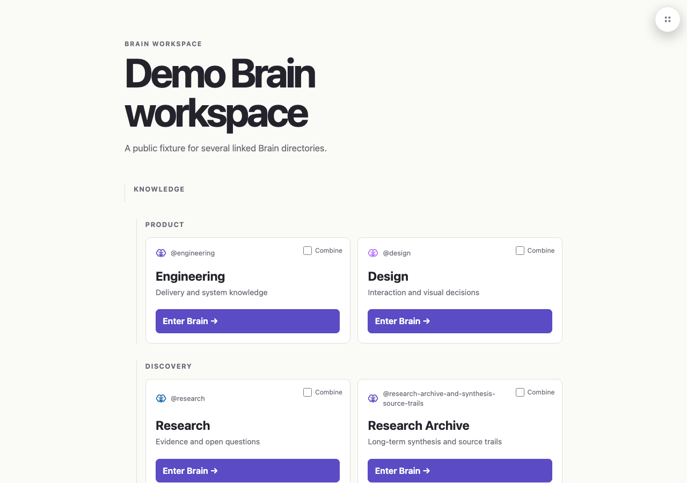

### Combined selection appears after intent

The phone chooser shows selected cards and the fixed combined-graph action after two Brains are selected.

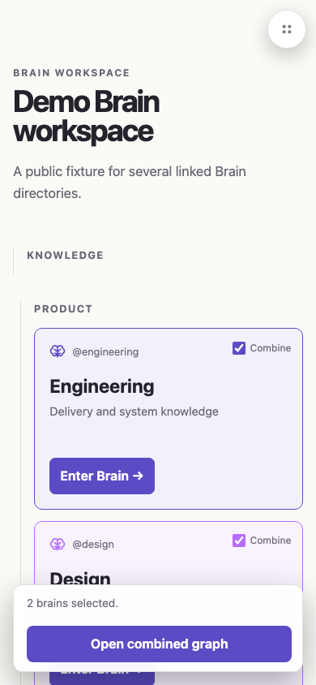

## Navigation, provenance, and browsing scope

### Visible Home and focused graph access

An isolated note keeps Home at the top left and a focused-graph action beside its title. The expanded navigation contains contextual destinations without duplicate Brains or About actions.

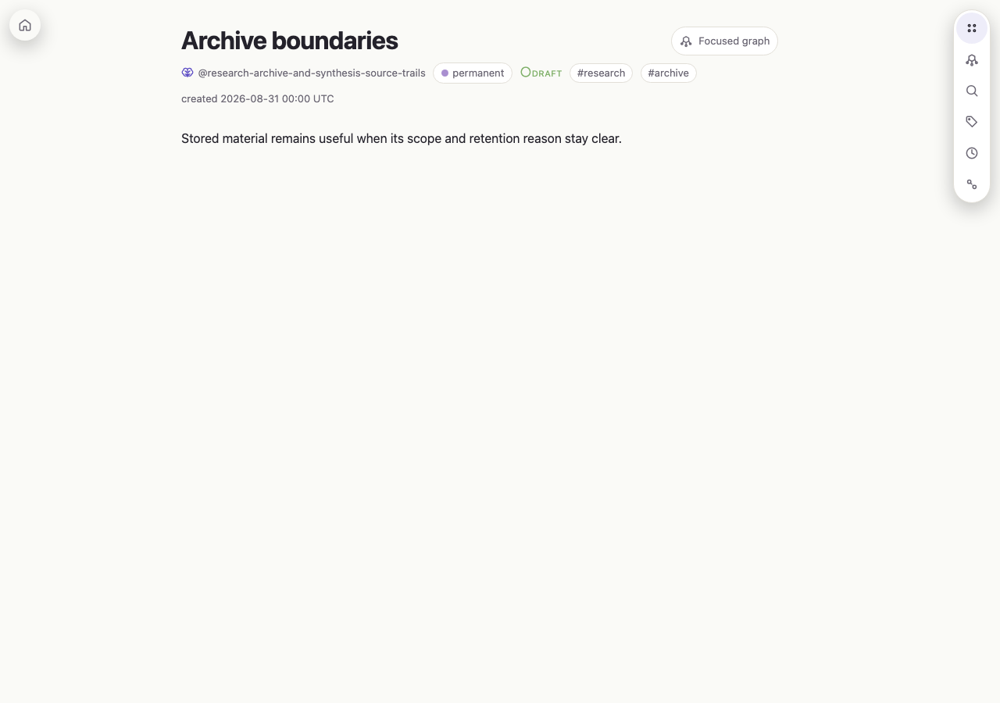

### Chooser-only About disclosure

About remains available on the Brain chooser and its package-derived `Brain v1.4.0` provenance stays contained in a 390 by 500 viewport.

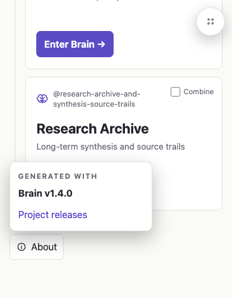

### Note ownership remains separate from selected browsing scope

The note remains owned by `@engineering`, while the quick switcher shows the retained selected scope `@engineering, @design` and limits results accordingly.

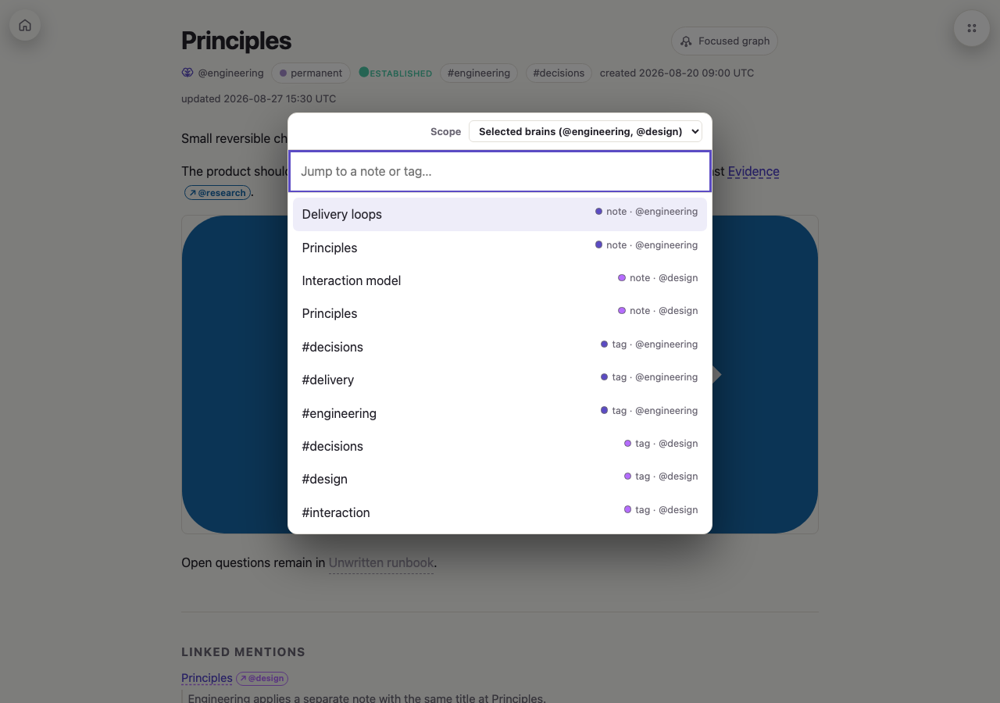

## Shareable graph focus

### Persistent focused neighborhood

The focused subject uses a non-color marker, keeps its direct neighborhood visible, and exposes Copy link, Open note, and Clear actions.

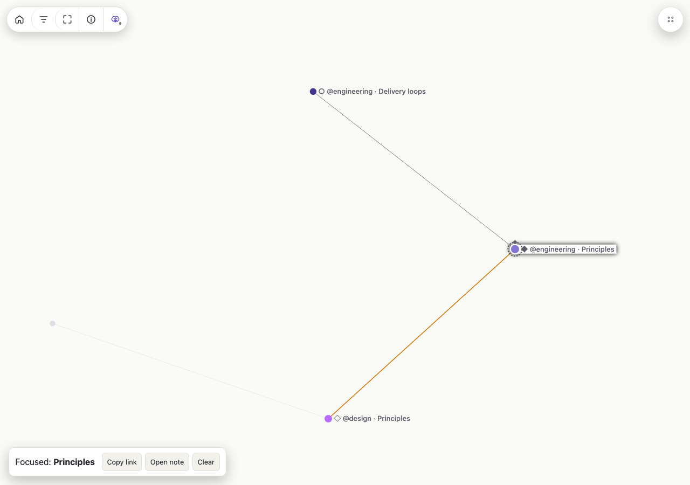

### Marker and title context menu

Right-clicking a graph target opens the bounded menu with Move focus here, Copy neighborhood link, and Open note.

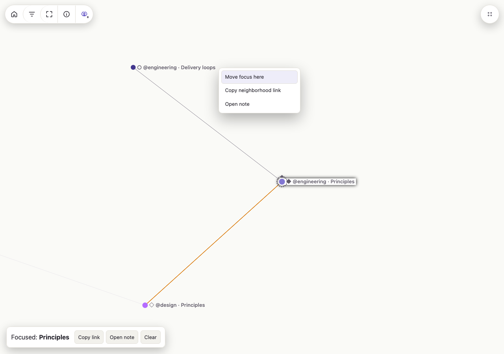

### Dark appearance

Focus markers, direct-neighborhood emphasis, and accessible actions remain visible in dark mode.

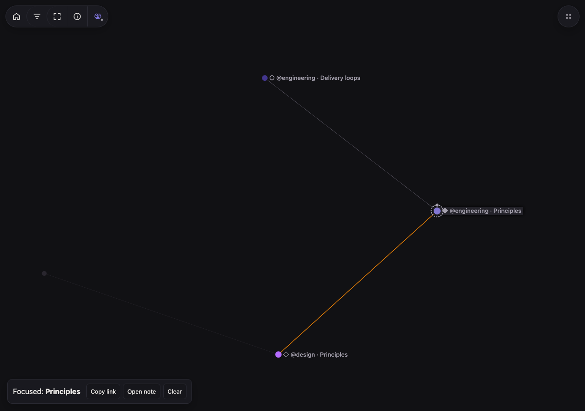

### Phone restoration

The same canonical focus URL restores and fits the neighborhood on a phone without carrying desktop camera state.

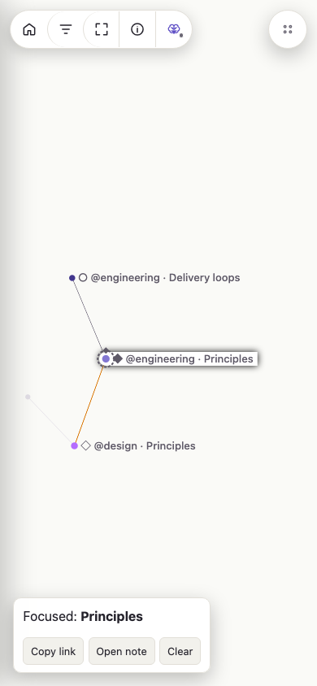

## Legend containment

The global legend remains inside the viewport with Filters closed at desktop, phone, and coarse-pointer tablet sizes.

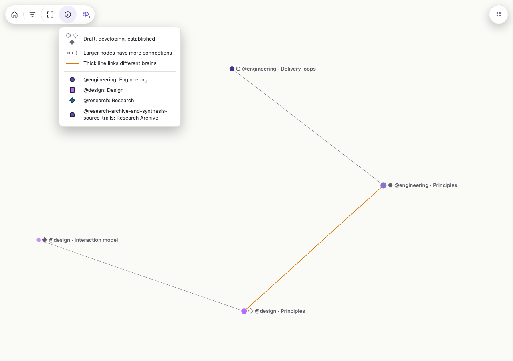

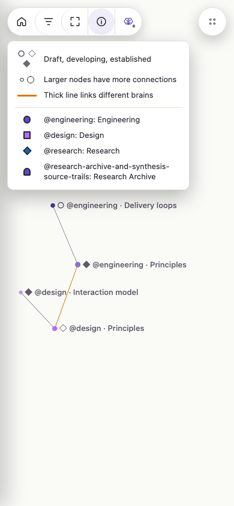

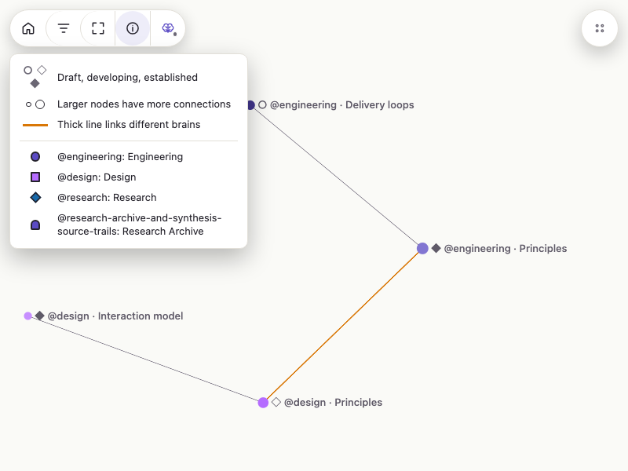

## External links

Authored external HTTP links have persistent solid underlines, box-arrow icons, and accessible external-site naming without forcing a new tab.

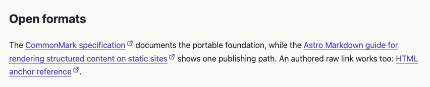

Long external links wrap without horizontal overflow on phone.

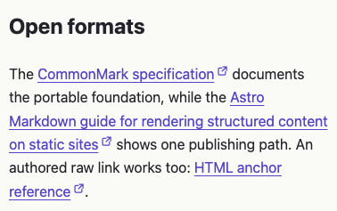

## Missing-page recovery

### Scoped deterministic recommendation

A missing workspace note retains the valid selected-Brain scope, links back to the selected graph, and shows a deterministic note recommendation with owner and tags.

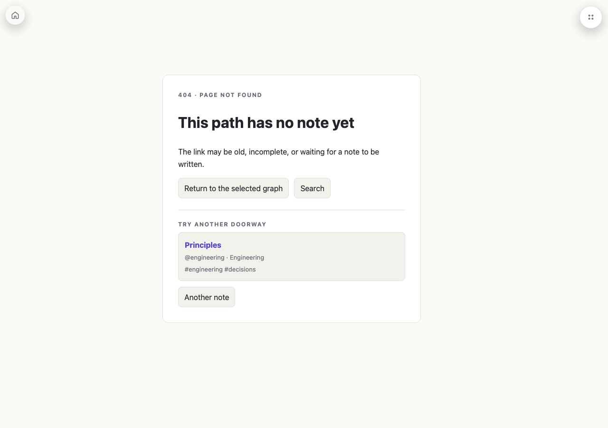

### Progressive Search

The 404 Search action opens the quick switcher on phone. Root recovery and recommendation remain visible behind the dialog.

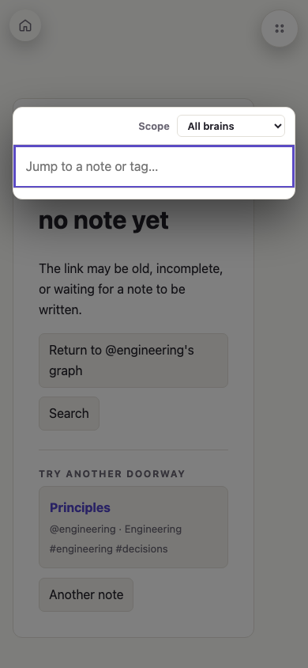

### Invalid combined selection

Unknown Brain selections use the shared recovery presentation and link safely back to the chooser.

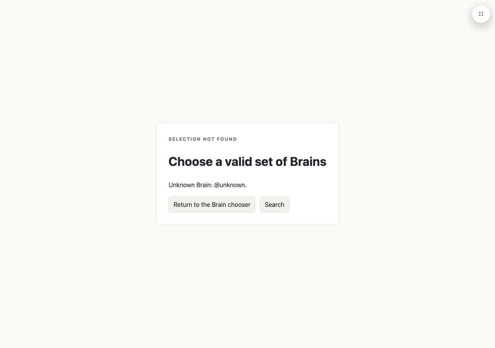

## Highlight rendering

Brain `==highlight==` syntax renders in linked-mention excerpts after wiki-link display text is resolved.

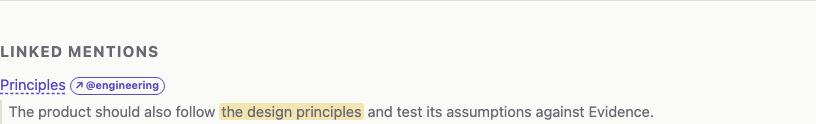

Inline potential-link treatment remains nested inside the authored highlight.

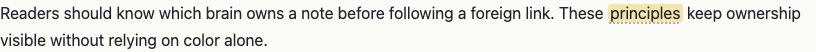

## Behavior verified without screenshots

Some requirements are route, server, metadata, or accessibility contracts rather than distinct visual states. Automated coverage verifies:

- canonical `brains` and `focus` query handling, including duplicate and invalid parameters;
- scope retention through graph nodes, wiki-links, mentions, nearby links, local maps, and quick-switcher results;
- clipboard URL contents and omission of camera, filter, and dragged-position state;
- touch long press, keyboard graph search, focused hover locking, right-click position stability, and native empty-stage context menus;
- generated `<meta name="generator">` values;
- external-origin classification, same-tab behavior, accessible names, and contrast;
- deterministic 404 recommendations, no-JavaScript root recovery, HTTP 404 status, `HEAD`, root/subpath serving, and missing-resource behavior.

## Refreshing the gallery

Start `scripts/serve-browser-fixture.mjs`, then run:

```sh
node openspec/changes/improve-reader-wayfinding-and-sharing/screenshots/capture.mjs
```
